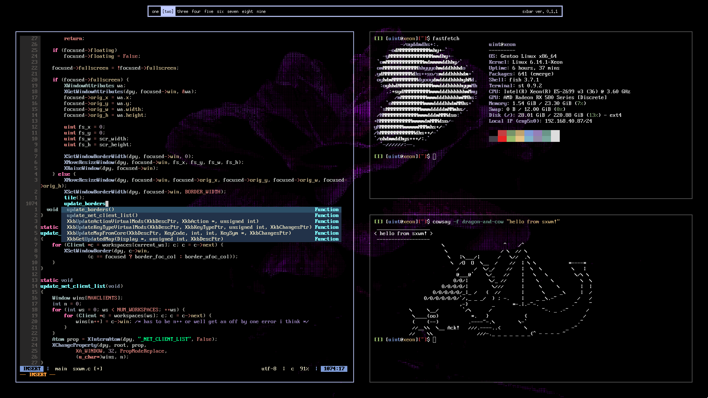
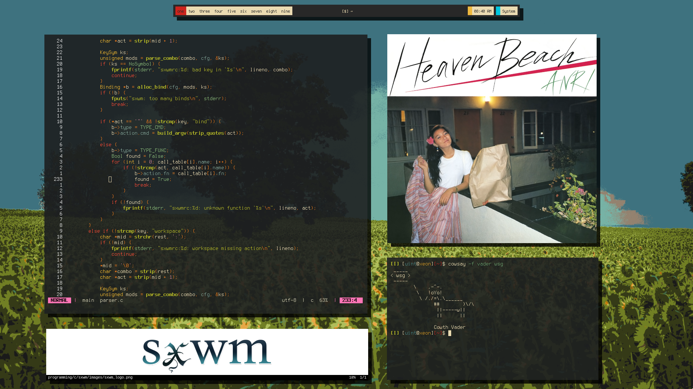

<div align="center">
  <h1 ></h1>
  <b>Minimal. Fast. Configurable. Tiling Window Manager for X11</b>
  <br>
  <sub>Abhinav Prasai (2025)</sub>
  <br><br>
  
  
</div>

---

## Features

- **Tiling & Floating**: Switch seamlessly between layouts.
- **Workspaces**: 9 workspaces, fully integrated with your bar.
- **Live Config Reload**: Change your config and reload instantly with a keybind.
- **Easy Configuration**: Human-friendly `sxwmrc` file, no C required.
- **Master-Stack Layout**: Productive, DWM-inspired workflow.
- **Mouse Support**: Move, swap, resize, and focus windows with the mouse.
- **Zero Dependencies**: Only `libX11` and `Xinerama` required.
- **Lightweight**: Single C file, minimal headers, compiles in seconds.
- **Bar Friendly**: Works great with [sxbar](https://github.com/uint23/sxbar).
- **Xinerama Support**: Multi-monitor ready.
- **Fast**: Designed for speed and low resource usage.

---

## Screenshots

<a href="1"></a>
<a href="2"></a>
<a href="3"></a>
<a href="4"></a>

<br clear="right">

---

## Patch Notes

<details>
<summary><strong>Click to expand</strong></summary>

#### v1.5 - Ready for Release

- **NEW**: Using XCursor instead of cursor font && new logo.
- **FIXED**: Proper bind resetting on refresh config. && Multi-arg binds now work due to new and improved spawn function
- **CHANGE**: No longer using INIT_WORKSPACE macro, proper workspace handling. New sxwmrc

#### v1.4
- **CHANGE**: Added motion throttle && master width general options

#### v1.3
- **CHANGE**: ulong, u_char uint are gone

#### v1.2
- **NEW**: Parser support
- **FIXED**: Quit syntax && Freeing cursor on exit

#### v1.1
- **NEW**: Xinerama support, swap windows with Mod + Shift + Drag
- **FIXED**: New windows in `global_floating` mode spawn centered

</details>

---

## Configuration (`~/.config/sxwmrc`)

`sxwm` is configured via a simple text file located at `~/.config/sxwmrc`. Changes can be applied instantly by reloading the configuration (default keybind: `MOD + r`).

The file uses a `key : value` format. Lines starting with `#` are ignored.

### General Options

| Option                  | Type    | Default   | Description                                                                 |
| ----------------------- | ------- | --------- | --------------------------------------------------------------------------- |
| `mod_key`               | String  | `super`   | Sets the primary modifier key (`alt`, `super`, `ctrl`).                       |
| `gaps`                  | Integer | `10`      | Pixels between windows and screen edges.                                    |
| `border_width`          | Integer | `1`       | Thickness of window borders in pixels.                                      |
| `focused_border_colour` | Hex     | `#c0cbff` | Border color for the currently focused window.                              |
| `unfocused_border_colour`| Hex     | `#555555` | Border color for unfocused windows.                                         |
| `swap_border_colour`    | Hex     | `#fff4c0` | Border color highlight when selecting a window to swap with (`MOD+Shift+Drag`).|
| `master_width`          | Integer | `60`      | Percentage (%) of the screen width the master window should occupy.         |
| `resize_master_amount`  | Integer | `1`       | Percentage (%) to increase/decrease the master width when resizing.         |
| `snap_distance`         | Integer | `5`       | Pixels from screen edge before a floating window snaps to the edge.         |
| `motion_throttle`       | Integer | `60`      | Target updates per second for mouse drag operations (move/resize/swap). Set close to your monitor's refresh rate for smoother visuals. |

### Keybindings

Keybindings associate key combinations with actions (either running external commands or internal `sxwm` functions).

**Syntax:**

``` sh
bind : [modifier + modifier + ... + key] : action
```

-   **`bind`**: Keyword to define a keybinding.
-   **`[...]`**: Contains the key combination.
    -   **Modifiers**: `mod` (uses the key set by `mod_key`), `shift`, `ctrl`, `alt`, `super`. Use `+` to combine multiple modifiers.
    -   **`key`**: The final key name (e.g., `Return`, `q`, `1`, `equal`, `space`). Key names generally follow X11 keysym names but are case-insensitive in the config.
-   **`:`**: Separator.
-   **`action`**:
    -   **Command**: An external command enclosed in double quotes (`"`). Arguments are separated by spaces (e.g., `"st -e vim"`).
    -   **Function**: The name of an internal `sxwm` function (see list below).

**Available Functions:**

| Function Name        | Action                                                      |
| -------------------- | ----------------------------------------------------------- |
| `close_window`       | Closes the currently focused window.                        |
| `decrease_gaps`      | Decreases the gap size between windows.                     |
| `focus_next`         | Shifts focus to the next window in the stack/list.          |
| `focus_previous`     | Shifts focus to the previous window in the stack/list.      |
| `increase_gaps`      | Increases the gap size between windows.                     |
| `master_next`        | Moves the focused window down the master/stack order.       |
| `master_previous`    | Moves the focused window up the master/stack order.         |
| `quit`               | Exits `sxwm`.                                               |
| `reload_config`      | Reloads the `sxwmrc` configuration file.                    |
| `master_increase`    | Increases the width allocated to the master area.           |
| `master_decrease`    | Decreases the width allocated to the master area.           |
| `toggle_floating`    | Toggles the floating state of the focused window.           |
| `global_floating`    | Toggles the floating state for *all* windows on the current workspace. |
| `fullscreen`         | Toggles fullscreen mode for the focused window.             |
| `change_ws[1-9]`     | Switches focus to the specified workspace (1-9).            |
| `moveto_ws[1-9]`     | Moves the focused window to the specified workspace (1-9).  |

**Example Bindings:**

```yaml
# Launch terminal with Mod + Enter
bind : [mod + Return] : "st"

# Close focused window with Mod + Shift + Q
bind : [mod + shift + q] : close_window

# Switch to workspace 3 with Mod + 3
bind : [mod + 3] : change_ws3

# Move focused window to workspace 5 with Mod + Shift + 5
bind : [mod + shift + 5] : moveto_ws5
```

---

## Default Keybindings

### Window Management

| Combo                        | Action                    |
| ---------------------------- | ------------------------- |
| Mouse                        | Focus under cursor        |
| `MOD` + Left Mouse           | Move window by mouse      |
| `MOD` + Right Mouse          | Resize window by mouse    |
| `MOD` + `j` / `k`            | Focus next / previous     |
| `MOD` + `Shift` + `j` / `k`  | Move in master stack      |
| `MOD` + `Space`              | Toggle floating           |
| `MOD` + `Shift` + `Space`    | Toggle all floating       |
| `MOD` + `=` / `-`            | Increase/Decrease gaps    |
| `MOD` + `f`                  | Fullscreen toggle         |
| `MOD` + `q`                  | Close focused window      |
| `MOD` + `1-9`                | Switch workspace 1–9      |
| `MOD` + `Shift` + `1-9`      | Move window to WS 1–9     |

### Programs

| Combo                | Action     | Program    |
| -------------------- | ---------- | ---------- |
| `MOD` + `Return`     | Terminal   | `st`       |
| `MOD` + `b`          | Browser    | `firefox`  |
| `MOD` + `p`          | Launcher   | `dmenu_run`|

---

## Dependencies

- `libX11` (Xorg client library)
- `Xinerama`
- GCC or Clang & Make

---

## Build & Install

### Arch Linux (AUR)

```sh
yay -S sxwm
```

### Build from Source

```sh
git clone --depth=1 https://github.com/uint23/sxwm.git
cd sxwm/
make
sudo make clean install
```

### Run

Add to your `~/.xinitrc`:
```sh
exec sxwm
```

---

## Makefile Targets

| Target                | Description                                         |
| --------------------- | --------------------------------------------------- |
| `make` / `make all`   | Build the `sxwm` binary                            |
| `make clean`          | Remove object files and build artifacts             |
| `make install`        | Install `sxwm` to `$(PREFIX)/bin` (default `/usr/local/bin`) |
| `make uninstall`      | Remove the installed binary                         |
| `make clean install`  | Clean and then install                              |

> Override install directory with `PREFIX` or `DESTDIR`:
> ```sh
> make install PREFIX=$HOME/.local
> ```

---

## Thanks & Inspiration

- [dwm](https://dwm.suckless.org) — Tiling & source code
- [i3](https://i3wm.org) — Easy configuration
- [sowm](https://github.com/dylanaraps/sowm) — README inspiration
- [tinywm](http://incise.org/tinywm.html) — Minimal X11 WM

---

<p align="center">
  <em>Contributions welcome! Open issues or submit PRs.</em>
</p>